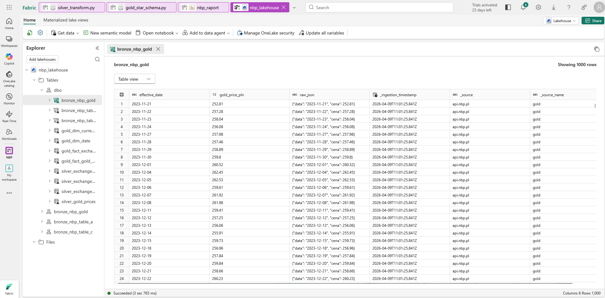
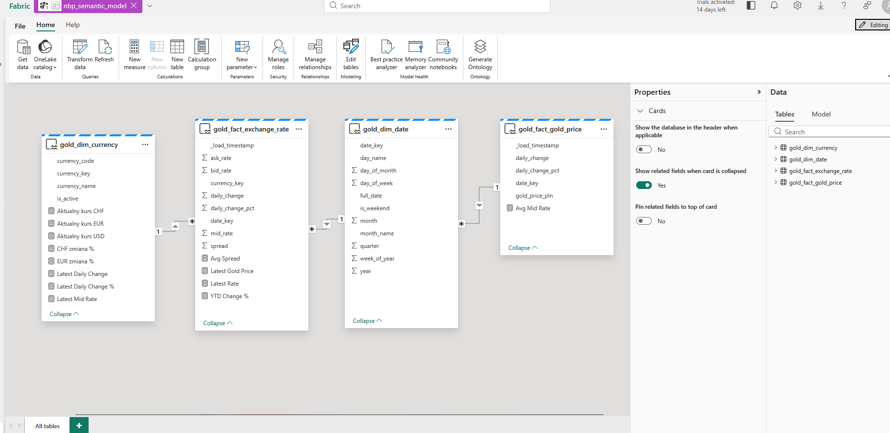
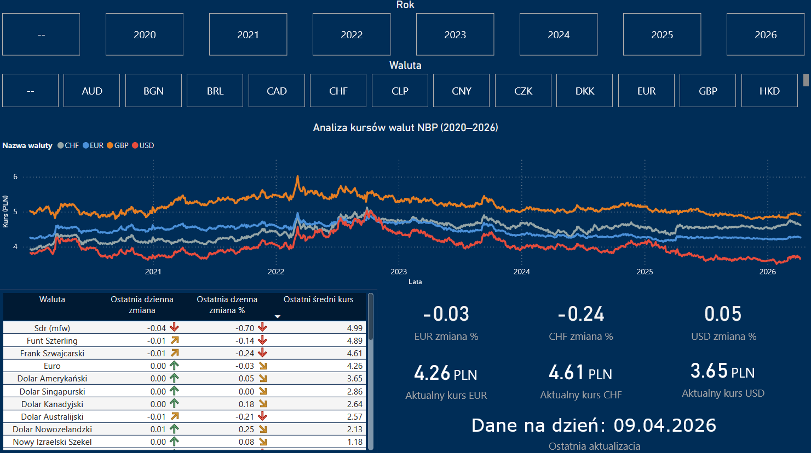
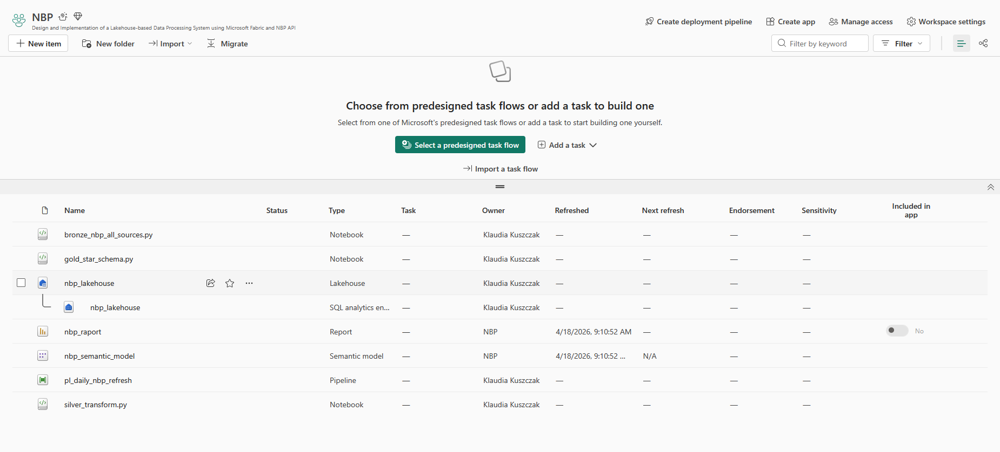

# NBP Data Pipeline — Medallion Architecture (Bronze / Silver / Gold)

*[Wersja polska](README.md)*

An ETL project that ingests data from the public API of the National Bank of Poland (NBP), processes it through a medallion architecture on **Microsoft Fabric** (PySpark + Delta Lake), and exposes it as a star schema in **Power BI** (DirectLake mode).

## Data sources

| NBP endpoint | Content |
|---|---|
| `exchangerates/tables/A` | Average exchange rates (`mid`) |
| `exchangerates/tables/C` | Buy/sell rates (`bid` / `ask`) |
| `cenyzlota` | Gold prices in PLN |

Date range: from `2020-01-01` to the run date.

## Data flow

```
NBP API  →  Bronze (raw Delta)  →  Silver (cleansed, validated)  →  Gold (star schema)  →  Power BI
```

| Layer | Notebook | Output tables |
|---|---|---|
| **Bronze** | `code-bronze/bronze_nbp_all_sources.py` | `bronze_nbp_table_a`, `bronze_nbp_table_c`, `bronze_nbp_gold` |
| **Silver** | `code-silver/silver_transform.py` | `silver_exchange_rates_a`, `silver_exchange_rates_c`, `silver_exchange_rates_merged`, `silver_gold_prices` |
| **Gold** | `code-gold/gold_star_schema.py` | `gold_dim_date`, `gold_dim_currency`, `gold_fact_exchange_rate`, `gold_fact_gold_price` |



## Semantic model

Two fact tables (exchange rates, gold prices) joined to date and currency dimensions via the surrogate keys `date_key` / `currency_key`.



## Report



## Repository structure

| Path | Description |
|---|---|
| `code-bronze/`, `code-silver/`, `code-gold/` | PySpark notebooks |
| `pipeline/` | Screenshots of the Fabric orchestration setup |
| `silver-layer-errors/` | Documentation of issues encountered and how they were resolved |
| `nbp_raport.pbix` | Power BI report |
| `DOCUMENTATION_EN.md` | Full technical documentation |

## Running the pipeline

Requirements: a Microsoft Fabric workspace with a Lakehouse (`nbp_lakehouse`), a Spark runtime with Delta Lake, and network access to `api.nbp.pl`.



1. Import the `.py` files as Fabric notebooks and attach them to the Lakehouse.
2. Run in order: **bronze → silver → gold**.
3. Configure sequential orchestration in a Fabric pipeline (see screenshots in `pipeline/`).
4. Connect `nbp_raport.pbix` to the Gold tables using DirectLake.

The notebooks are idempotent — every run overwrites its tables (`mode("overwrite")`), so re-running never duplicates data.

## Key design decisions

- **Explicit Spark schemas in Bronze** — table A returns no `bid`/`ask` and gold has no currency fields; when every value in a column is `None`, Spark raises `CANNOT_DETERMINE_TYPE`.
- **Requests split into 93-day windows** — a hard limit of the NBP API per request.
- **HTTP fault tolerance** — a single failed request returns an empty list instead of aborting the whole job.
- **Silver validations** — rates must be positive; table C additionally enforces `bid < ask`.
- **`ZORDER` on fact tables** — read optimization on `date_key` / `currency_key`.

## Known limitations

Deliberately deferred to later stages (a migration to Databricks is planned):

- Full reload instead of incremental loading — no CDC/append mechanism.
- Bronze writes by path (`.save`) while Silver/Gold read by table name — hence the manual `CREATE TABLE ... LOCATION` registration.
- In `silver_exchange_rates_merged`, `currency_name` and `table_no_a` are taken from table A only; rows present exclusively in table C will have `NULL` there.
- No unit tests and no `requirements.txt`.

Details: **[DOCUMENTATION_EN.md](DOCUMENTATION_EN.md)**

## Data source

[NBP API](https://api.nbp.pl/) — public, no authentication required. Data provided by the National Bank of Poland.

## License

Released under the [MIT License](LICENSE) — © 2026 Klaudia Kuszczak.

The license covers the source code only. Data retrieved from the NBP API is subject to the terms of use set by the National Bank of Poland.
